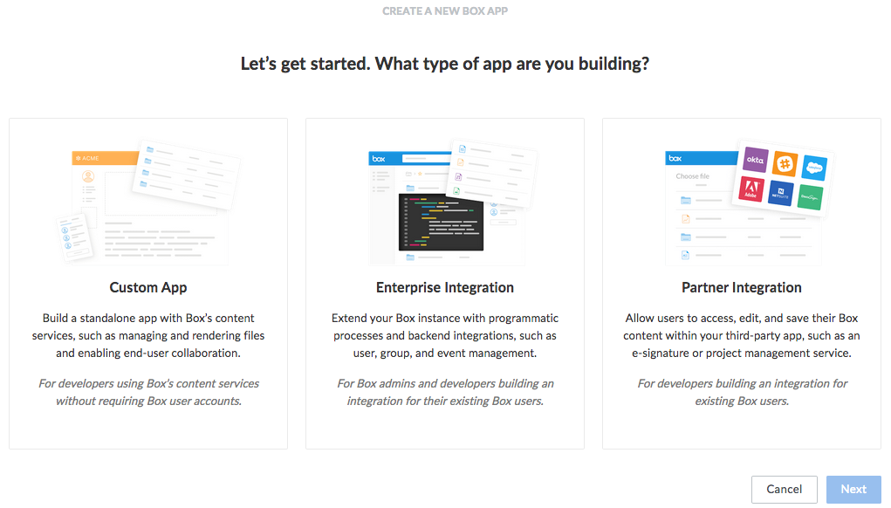
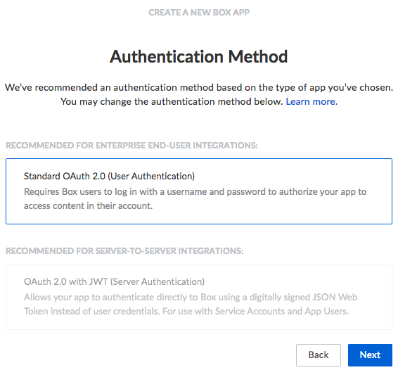

Box Authenticator Plug-in
=========================

.. image:: https://travis-ci.org/curityio/box-authenticator.svg?branch=dev
    :target: https://travis-ci.org/curityio/box-authenticator

This project provides an opens source Box Authenticator plug-in for the Curity Identity Server. This allows an administrator to add functionality to Curity which will then enable end users to login using their Box credentials. The app that integrates with Curity may also be configured to receive the Box access token and refresh token, allowing it to manage resources in a Box enterprise.

System Requirements
~~~~~~~~~~~~~~~~~~~

* Curity Identity Server 3.0.0 and `its system requirements <https://developer.curity.io/docs/latest/system-admin-guide/system-requirements.html>`_

Requirements for Building from Source
"""""""""""""""""""""""""""""""""""""

* Maven 3
* Java JDK v. 8

Compiling the Plug-in from Source
~~~~~~~~~~~~~~~~~~~~~~~~~~~~~~~~~

The source is very easy to compile. To do so from a shell, issue this command: ``mvn package``.

Installation
~~~~~~~~~~~~

To install this plug-in, either download a binary version available from the `releases section of this project's GitHub repository <https://github.com/curityio/box-authenticator/releases>`_ or compile it from source (as described above). If you compiled the plug-in from source, the package will be placed in the ``target`` subdirectory. The resulting JAR file or the one downloaded from GitHub needs to placed in the directory ``${IDSVR_HOME}/usr/share/lib/box``. (The name of the last directory, ``box``, which is the plug-in group, is arbitrary and can be anything.) After doing so, the plug-in will become available as soon as the node is restarted.

.. note::

    The JAR file needs to be deployed to each run-time node and the admin node. For simple test deployments where the admin node is a run-time node, the JAR file only needs to be copied to one location.

For a more detailed explanation of installing plug-ins, refer to the `Curity developer guide <https://developer.curity.io/docs/latest/developer-guide/plugins/index.html#plugin-installation>`_.

Creating an App in Box
~~~~~~~~~~~~~~~~~~~~~~

As `described in the Box documentation <https://developer.box.com/docs/getting-started-box-integration>`_, you can `create different kinds of apps <https://app.box.com/developers/console/newapp>`_ that use the Box APIs. When using this plug-in, create a new ``Enterprise Integration``, as shown in the following figure:

    Creating a new Box Enterprise Integration application

The authentication method, as shown in the following figure, should be ``Standard OAuth 2.0 (User Authentication)``:

    Selecting to authenticate users in the new app

Then, give the app a name, e.g., ``Curity-Enterprise-Integration-App``.

When you view the app's configuration after creating it, you'll find the ``Client ID`` and ``Client Secret``. These will be needed later when configuring the plug-in in Curity.

Box will also display the redirect URI in the new app's configuration. This needs to match the yet-to-be-created Box authenticator instance in Curity. The default will not work, and, if used, will result in an error. This should be updated to some URL that follows the pattern ``$baseUrl/$authenticationEndpointPath/$boxAuthnticatorId/callback``, where each of these URI components has the following meaning:

============================== =========================================================================================
URI Component                  Meaning
------------------------------ -----------------------------------------------------------------------------------------
``baseUrl``                    The base URL of the server (defined on the ``System --> General`` page of the
                               admin GUI). If this value is not set, then the server scheme, name, and port should be
                               used (e.g., ``https://localhost:8443``).
``authenticaitonEndpointPath`` The path of the authentication endpoint. In the admin GUI, this is located in the
                               authentication profile's ``Endpoints`` tab for the endpoint that has the type
                               ``auth-authentication``.
``boxAuthenticatorId``         This is the name given to the Box authenticator when defining it (e.g., ``box1``).
============================== =========================================================================================

Once the redirect URI is updated, the app is ready to be used from Curity. It could be helpful to also enable additional scopes. Scopes are the Box-related rights or permissions that the app is requesting. If the final application (not Curity, but the downstream app) is going to perform actions using the Box API, additional scopes probably should be enabled. Refer to the `Box documentation on scopes <https://developer.box.com/docs/authentication#section-oauth-2-scopes>`_ for an explanation of those that can be enabled and what they allow.

.. warning::

    If the app configuration in Box does not allow a certain scope (e.g., the ``Manage Webhooks`` scope) but that scope is enabled in the authenticator in Curity, a server error will result. For this reason, it is important to align these two configurations or not to define any when configuring the plug-in in Curity.

Creating a Box Authenticator in Curity
~~~~~~~~~~~~~~~~~~~~~~~~~~~~~~~~~~~~~~

The easiest way to configure a new Box authenticator is using the Curity admin UI. The configuration for this can be downloaded as XML or CLI commands later, so only the steps to do this in the GUI will be described.

1. Go to the ``Authenticators`` page of the authentication profile wherein the authenticator instance should be created.
2. Click the ``New Authenticator`` button.
3. Enter a name (e.g., ``box1``). This name needs to match the URI component in the callback URI set in the Box app.
4. For the type, pick the ``Box`` option:

    .. figure:: docs/images/box-authenticator-type-in-curity.png
        :align: center
        :width: 600px

5. On the next page, you can define all of the standard authenticator configuration options like any previous authenticator that should run, the resulting ACR, transformers that should executed, etc. At the bottom of the configuration page, the Box-specific options can be found.

    .. note::

        The Box-specific configuration is generated dynamically based on the `configuration model defined in the Java interface <https://github.com/curityio/box-authenticator/blob/master/src/main/java/io/curity/identityserver/plugin/box/config/BoxAuthenticatorPluginConfig.java>`_.

6. Certain required and optional configuration settings may be provided. One of these is the ``HTTP Client`` setting. This is the HTTP client that will be used to communicate with the Box OAuth server's token and user info endpoints. To define this, do the following:

    A. click the ``Facilities`` button at the top-right of the screen.
    B. Next to ``HTTP``, click ``New``.
    C. Enter some name (e.g., ``boxClient``).
    D. Toggle on the ``Use Truststore`` option and click ``Apply``.

        .. figure:: docs/images/box-http-client.png
            :align: center
            :width: 400px

7. Back in the Box authenticator instance that you started to define, select the new HTTP client from the dropdown.

    .. figure:: docs/images/http-client.png

8. Also in the ``Facilities`` view, you probably need to add the intermediary Certificate Authority (CA) used to sign the SSL certificate on Box's token and user info endpoints. (You'll get a server error and find a PKIX-related message in the server log when attempting to login with the Box authenticator if this is necessary.) To do this, perform the following steps:

    A. Click ``Facilities``.
    B. Next to ``Server Trust Stores``, click ``New``.
    C. Enter the text of the intermediary CA and give it a name (e.g., ``Box_Intermediate_CA``). Currently, the certificate of this CA is this:

        .. code-block::

            -----BEGIN CERTIFICATE-----
            MIIDVDCCAjygAwIBAgIDAjRWMA0GCSqGSIb3DQEBBQUAMEIxCzAJBgNVBAYTAlVT
            MRYwFAYDVQQKEw1HZW9UcnVzdCBJbmMuMRswGQYDVQQDExJHZW9UcnVzdCBHbG9i
            YWwgQ0EwHhcNMDIwNTIxMDQwMDAwWhcNMjIwNTIxMDQwMDAwWjBCMQswCQYDVQQG
            EwJVUzEWMBQGA1UEChMNR2VvVHJ1c3QgSW5jLjEbMBkGA1UEAxMSR2VvVHJ1c3Qg
            R2xvYmFsIENBMIIBIjANBgkqhkiG9w0BAQEFAAOCAQ8AMIIBCgKCAQEA2swYYzD9
            9BcjGlZ+W988bDjkcbd4kdS8odhM+KhDtgPpTSEHCIjaWC9mOSm9BXiLnTjoBbdq
            fnGk5sRgprDvgOSJKA+eJdbtg/OtppHHmMlCGDUUna2YRpIuT8rxh0PBFpVXLVDv
            iS2Aelet8u5fa9IAjbkU+BQVNdnARqN7csiRv8lVK83Qlz6cJmTM386DGXHKTubU
            1XupGc1V3sjs0l44U+VcT4wt/lAjNvxm5suOpDkZALeVAjmRCw7+OC7RHQWa9k0+
            bw8HHa8sHo9gOeL6NlMTOdReJivbPagUvTLrGAMoUgRx5aszPeE4uwc2hGKceeoW
            MPRfwCvocWvk+QIDAQABo1MwUTAPBgNVHRMBAf8EBTADAQH/MB0GA1UdDgQWBBTA
            ephojYn7qwVkDBF9qn1luMrMTjAfBgNVHSMEGDAWgBTAephojYn7qwVkDBF9qn1l
            uMrMTjANBgkqhkiG9w0BAQUFAAOCAQEANeMpauUvXVSOKVCUn5kaFOSPeCpilKIn
            Z57QzxpeR+nBsqTP3UEaBU6bS+5Kb1VSsyShNwrrZHYqLizz/Tt1kL/6cdjHPTfS
            tQWVYrmm3ok9Nns4d0iXrKYgjy6myQzCsplFAMfOEVEiIuCl6rYVSAlk6l5PdPcF
            PseKUgzbFbS9bZvlxrFUaKnjaZC2mqUPuLk/IH2uSrW4nOQdtqvmlKXBx4Ot2/Un
            hw4EbNX/3aBd7YdStysVAq45pmp06drE57xNNB6pXE0zX5IJL4hmXXeXxx12E6nV
            5fEWCRE11azbJHFwLJhWC9kXtNHjUStedejV0NxPNO3CBWaAocvmMw==
            -----END CERTIFICATE-----

    D. If you have downloaded it, browse to the file. In any case, click the ``Add`` button.

9. In the ``Client ID`` textfield, enter the client ID from the Box app configuration. This is the auto-generated ID that was shown after picking the app type and authentication method.
10. Also enter the matching ``Client Secret``.
11. If you have enabled any scopes or wish to limit the scopes that Curity will request of Box, toggle on the desired scopes (e.g., ``Enterprise Properties`` or ``Manage Groups``).

Once all of these changes are made, they will be staged, but not committed (i.e., not running). To make them active, click the ``Commit`` menu option in the ``Changes`` menu. Optionally enter a comment in the ``Deploy Changes`` dialogue and click ``OK``.

Once the configuration is committed and running, the authenticator can be used like any other.

Passing Box's Tokens Downstream
"""""""""""""""""""""""""""""""

When using the Box authenticator together with an OpenID Connect Relying Party app (i.e., a client), it can be helpful to pass along Box's access token and refresh token. This will allow the app to make calls to Box's APIs. To do this, a custom procedure has to be created that relays the tokens; otherwise, they'll be dropped. To do this, follow these steps in the OAuth profile that is associated with the authentication profile where the Box authenticator was defined:

1. Click on ``Endpoints``.
2. Find the one of type ``oauth-authorize`` and select a procedure from the ``Authorize Authorization Code`` dropdown.
3. Click the ``Edit`` button.
4. In the script editor that opens, enter the following script:

    .. code-block:: javascript

        function result(context) {
            var authorizationCodeData = context.getDefaultAuthorizationCodeData();
            var contextAttributes = context.contextAttributes();

            authorizationCodeData.box_access_token = contextAttributes.box_access_token;
            authorizationCodeData.box_refresh_token = contextAttributes.box_refresh_token;

            var issuedAuthorizationCode = context.authorizationCodeIssuer.issue(authorizationCodeData);

            return {
                code: issuedAuthorizationCode,
                state: context.providedState
            };
        }

    In this script, the context attributes are retrieved. These are the ones that `the plug-in adds <https://github.com/curityio/box-authenticator/blob/master/src/main/java/io/curity/identityserver/plugin/box/authentication/CallbackRequestHandler.java#L189>`_. From these, the Box access and refresh tokens are stored with the nonce that the Curity OAuth server issues.

5. When this code is redeemed, these will be available in the context of subsequent scripts that run. For instance, if a downstream app is integrating with Curity using the code flow, then the ``Token Authorization Code`` procedure on the ``oauth-token`` endpoint should be customized. This procedure may pass on Box's tokens to the client in the ID token (if the app is allowed to use the ``openid`` scope and OpenID Connect is enabled in the profile) and/or to the API in the access token. The following script passes on Box's tokens to both the app and the back-end API:

    .. code-block:: javascript

        function result(context) {
            var delegationData = context.getDefaultDelegationData();
            var nonceData = context.presentedNonce.data

            var issuedDelegation = context.delegationIssuer.issue(delegationData);
            var accessTokenData = context.getDefaultAccessTokenData();

            accessTokenData.box_access_token = nonceData.box_access_token;
            accessTokenData.box_refresh_token = nonceData.box_refresh_token

            var issuedAccessToken = context.accessTokenIssuer.issue(accessTokenData, issuedDelegation);

            var refreshTokenData = context.getDefaultRefreshTokenData();
            var issuedRefreshToken = context.refreshTokenIssuer.issue(refreshTokenData, issuedDelegation);

            var responseData = {
                access_token: issuedAccessToken,
                refresh_token: issuedRefreshToken,
                token_type: 'bearer',
                expires_in: secondsUntil(accessTokenData.exp)
            };

            if (context.scopeNames.contains('openid')) {
                var idTokenData = context.getDefaultIdTokenData();
                var idTokenIssuer = context.idTokenIssuer;

                idTokenData.box_access_token = nonceData.box_access_token;
                idTokenData.box_refresh_token = nonceData.box_refresh_token;
                idTokenData.at_hash = idTokenIssuer.atHash(issuedAccessToken);

                responseData.id_token = idTokenIssuer.issue(idTokenData);
            }

            return responseData;
        }

    Here, the ``context`` object has a property called ``presentedNonce``. This is the authorization code presented to Curity's token endpoint. The Box tokens were associated with this by the previous procedure. These are added to the ``accessTokenData`` that is the input of the ``accessTokenIssuer``. This will mean that Curity's access token (whether it is a JWT or an opaque GUID) will include Box's. This will allow the back-end APIs to call Box's APIs. Box's tokens are also included in the ``idTokenData`` that is used when issuing an ID token to the app.

License
~~~~~~~

This plugin and its associated documentation is listed under the `Apache 2 license <LICENSE>`_.

More Information
~~~~~~~~~~~~~~~~

Please visit `curity.io <https://curity.io/>`_ for more information about the Curity Identity Server.

Copyright (C) 2017 Curity AB.
